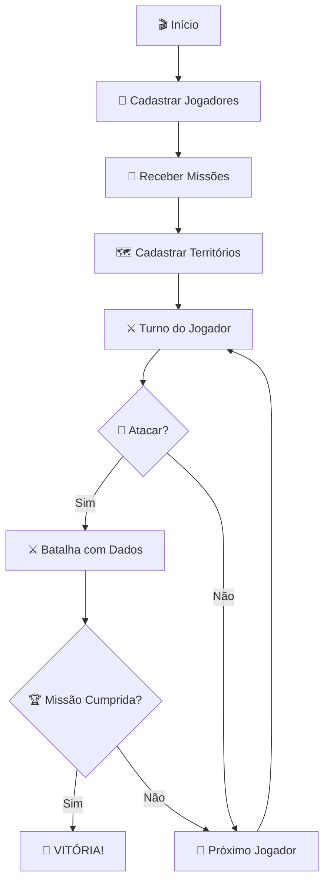

<div align="center">


# 🎲 WAR - Jogo de Estratégia

### *Conquiste territórios, cumpra missões e domine o mundo!*

[](https://en.wikipedia.org/wiki/C_(programming_language))
[](https://www.microsoft.com/windows)
[](https://github.com)

**Trabalho Acadêmico - Faculdade Estácio**

---

</div>

## 📖 Sobre o Projeto

Implementação completa do clássico jogo de tabuleiro **WAR** em linguagem C, desenvolvido para a disciplina de **Programação Estruturada** da **Faculdade Estácio**. O projeto aplica conceitos fundamentais como structs, ponteiros, alocação dinâmica e modularização através de três níveis progressivos de dificuldade.

<div align="center">

### 🎯 Conceitos Aplicados

| 📦 Estruturas | 💾 Memória | 🔧 Técnicas |
|:-------------:|:----------:|:-----------:|
| `structs` | `malloc` | Ponteiros |
| `typedef` | `calloc` | Recursividade |
| Vetores | `free` | Modularização |

</div>

---

## 🚀 Funcionalidades Principais

<table>
<tr>
<td width="50%" valign="top">

### ⚔️ Sistema de Combate
```
🎲 Batalhas com dados (1-6)
🏴 Conquista de territórios
👥 Transferência de tropas
✅ Validações inteligentes
```

</td>
<td width="50%" valign="top">

### 🗺️ Gerenciamento
```
📍 Cadastro dinâmico
🔄 Sistema de turnos
👥 Múltiplos jogadores
📊 Visualização em tempo real
```

</td>
</tr>
</table>

### 🎯 Missões Estratégicas

Cada jogador recebe uma missão aleatória no início da partida:

<div align="center">

| 🏆 Missão | 📋 Objetivo |
|-----------|-------------|
| **Conquistador** | Dominar 3 territórios consecutivos |
| **Imperador** | Conquistar 4 territórios quaisquer |
| **General** | Acumular 20 tropas no total |
| **Comandante** | Acumular 30 tropas no total |
| **Dominador** | Controlar a maioria do mapa |

</div>

---

## 🎯 Níveis de Desenvolvimento

<div align="center">

```
┌─────────────────────────────────────────────────────────────┐
│                                                             │
│  📘 NOVATO  ───────▶  📙 AVENTUREIRO  ───────▶  📕 MESTRE  │
│                                                             │
│  Fundamentos        Interatividade         Estratégia      │
│  • Structs          • Alocação Dinâmica    • Missões       │
│  • Vetores          • Ponteiros            • Vitória       │
│  • I/O              • Combate              • Turnos        │
│                                                             │
└─────────────────────────────────────────────────────────────┘
```

</div>

<details>
<summary><b>📘 Nível Novato - Fundamentos</b></summary>

**Objetivo:** Sistema de cadastro de territórios

**Implementações:**
- Definição de structs
- Vetores de estruturas  
- Entrada e saída formatada
- Loops básicos

**Entregável:** Cadastro de 5 territórios com exibição

</details>

<details>
<summary><b>📙 Nível Aventureiro - Interatividade</b></summary>

**Objetivo:** Sistema de combate entre territórios

**Implementações:**
- Alocação dinâmica (`malloc`, `calloc`)
- Manipulação de ponteiros
- Geração de números aleatórios
- Modularização com funções

**Entregável:** Sistema completo de batalhas

</details>

<details>
<summary><b>📕 Nível Mestre - Estratégia</b></summary>

**Objetivo:** Missões e condições de vitória

**Implementações:**
- Gerenciamento avançado de memória
- Passagem por valor/referência
- Verificação de objetivos
- Sistema de turnos

**Entregável:** Jogo WAR completo funcional

</details>

---

## 💻 Como Executar

### 📋 Pré-requisitos
- Compilador GCC (MinGW para Windows)
- Sistema operacional Windows

### ⚙️ Compilação
```bash
gcc war-challenge.c -o war-challenge
```

### ▶️ Execução
```bash
.\war-challenge
```

---

## 🎮 Como Jogar

<div align="center">

### 🎯 Fluxo do Jogo



</div>

### 📊 Exemplo de Partida

```c
========================================
    🎲 JOGO WAR - SISTEMA DE COMBATE
========================================

Jogadores: 2
  👤 Alice  [🔴 Vermelho]
  👤 Bob    [🔵 Azul]

🎯 Missões Distribuídas:
  Alice → Conquistar 3 territórios
  Bob   → Acumular 20 tropas

━━━━━━━━━━━━━━━━━━━━━━━━━━━━━━━━━━━━━━

TURNO 1 - Alice (🔴)

Território Atacante: Brasil (🔴 10 tropas)
Território Defensor: Argentina (🔵 8 tropas)

🎲 Dados Lançados:
   Atacante: 5 ⚄
   Defensor: 3 ⚂

>>> 🎉 ATACANTE VENCEU! <<<

Argentina agora é 🔴 Vermelho!
```

---

## 🏗️ Arquitetura do Código

<div align="center">

### 📦 Estruturas de Dados

</div>

```c
// Representação de um território no mapa
typedef struct {
    char nome[30];      // Nome do território
    char cor[10];       // Cor do exército ocupante
    int tropas;         // Quantidade de tropas
} Territorio;

// Representação de um jogador
typedef struct {
    char nome[30];      // Nome do jogador
    char cor[10];       // Cor do seu exército
    char* missao;       // Missão estratégica (dinâmica)
} Jogador;
```

<div align="center">

### 🔧 Funções Principais

</div>

<table>
<tr>
<th>Função</th>
<th>Responsabilidade</th>
<th>Técnica</th>
</tr>
<tr>
<td><code>cadastrarTerritorios()</code></td>
<td>Registra territórios do mapa</td>
<td>Ponteiros</td>
</tr>
<tr>
<td><code>cadastrarJogadores()</code></td>
<td>Registra jogadores</td>
<td>Alocação Dinâmica</td>
</tr>
<tr>
<td><code>atribuirMissao()</code></td>
<td>Sorteia missão aleatória</td>
<td>Passagem por Referência</td>
</tr>
<tr>
<td><code>atacar()</code></td>
<td>Simula batalha com dados</td>
<td>Aleatoriedade</td>
</tr>
<tr>
<td><code>verificarMissao()</code></td>
<td>Verifica condição de vitória</td>
<td>Lógica Condicional</td>
</tr>
<tr>
<td><code>liberarMemoria()</code></td>
<td>Libera memória alocada</td>
<td>Gerenciamento de Memória</td>
</tr>
</table>

---

## ✅ Requisitos Atendidos

<div align="center">

| Categoria | Implementação | Status |
|:---------:|:-------------:|:------:|
| **Structs** | Territorio & Jogador | ✅ |
| **Alocação Dinâmica** | malloc, calloc, free | ✅ |
| **Ponteiros** | Passagem por referência | ✅ |
| **Modularização** | 8 funções especializadas | ✅ |
| **Aleatoriedade** | srand, rand | ✅ |
| **Memória** | Sem vazamentos | ✅ |
| **Interface** | Mensagens claras | ✅ |
| **Validações** | Todas as jogadas | ✅ |

### 🎯 Validações Implementadas

```
✓ Mínimo de 2 jogadores e territórios
✓ Apenas ataca territórios próprios
✓ Não ataca territórios aliados
✓ Mínimo de 2 tropas para atacar
✓ Verificação automática de vitória
✓ Gerenciamento seguro de memória
```

</div>

---

## 🛠️ Stack Tecnológica

<div align="center">


### 📚 Bibliotecas Utilizadas

`stdio.h` • `stdlib.h` • `string.h` • `time.h` • `windows.h` • `locale.h`

</div>

---

## 🎨 Diferenciais do Projeto

<div align="center">

| 🌟 Feature | 📝 Descrição |
|-----------|-------------|
| **Encoding UTF-8** | Suporte completo à acentuação brasileira |
| **Sistema de Turnos** | Alternância automática entre jogadores |
| **Validação Inteligente** | Apenas permite jogadas válidas |
| **Feedback Visual** | Mensagens claras e formatadas |
| **Zero Memory Leaks** | Gerenciamento adequado de memória |
| **Código Documentado** | Comentários explicativos em português |

</div>

---

<div align="center">

## 🎓 Informações Acadêmicas

**Instituição:** Faculdade Estácio  
**Disciplina:** Estruturas de dados  
**Linguagem:** C (C99)  
**Paradigma:** Estruturas de dados

---

### 📄 Licença

Este projeto foi desenvolvido exclusivamente para fins educacionais.

---

### 💙 Desenvolvido com dedicação

*"Programar é transformar problemas com código e soluções em realidade."*

⭐ **Se este projeto ajudou nos seus estudos, considere deixar uma estrela!**
</div>